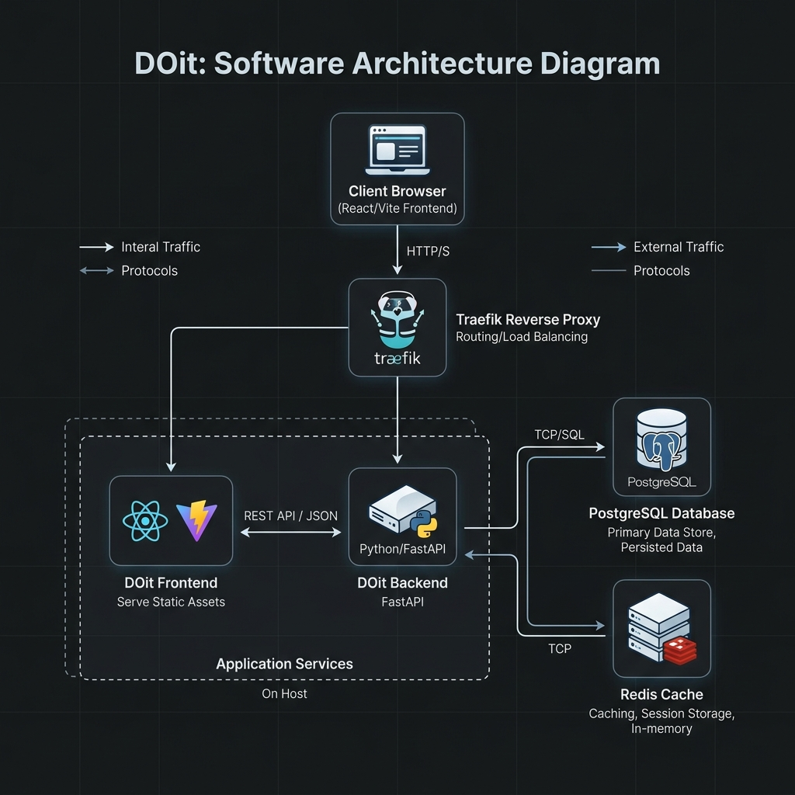
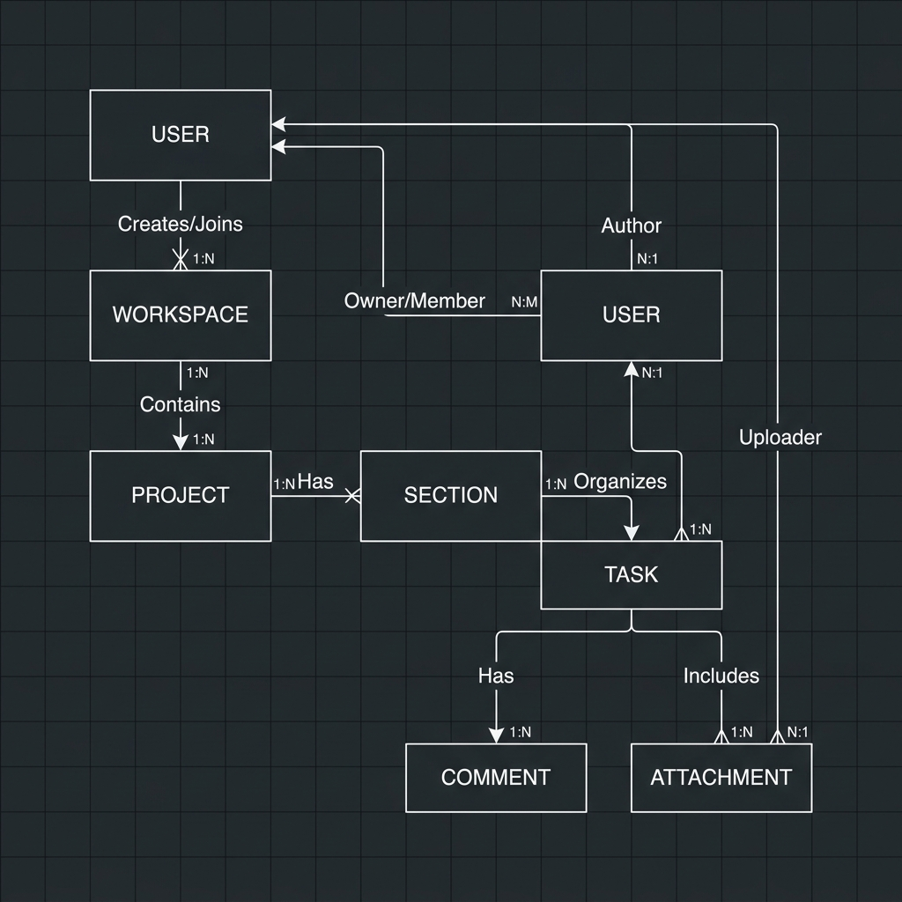

# DOit - Task Management Platform

## Overview

DOit is a modern, fully dockerized Task Management Platform designed to help teams and individuals organize projects, tasks, and workspaces. Built with performance and scalability in mind, the platform provides a responsive dashboard, robust REST API, and secure authentication.




## Technology Stack

- ⚡ **Backend**: [FastAPI](https://fastapi.tiangolo.com) (Python)
    - **ORM**: SQLAlchemy
    - **Database**: PostgreSQL
    - **Caching/Queue**: Redis
    - **Validation**: Pydantic
- 🚀 **Frontend**: [React](https://react.dev)
    - **Language**: TypeScript
    - **Build Tool**: Vite
    - **Routing**: React Router
- 🐋 **Infrastructure**: Docker & Docker Compose
- 📞 **Reverse Proxy**: Traefik (Handles automatic HTTPS via Let's Encrypt)
- 🏭 **CI/CD**: Fully automated via GitHub Actions (Testing, Linting, Building, and Deployment)

## Features

- **Secure Authentication**: JWT-based login and password hashing by default.
- **Workspaces & Projects**: Organize tasks logically within dedicated workspaces and projects.
- **Task Management**: Create, assign, edit, and track tasks effectively.
- **Dark Mode Support**: Built-in dark mode capabilities in the UI.
- **Automated CI/CD**: Seamless testing and zero-downtime deployments via GitHub Actions and DockerHub.

## Local Development

To get started with local development, ensure you have **Docker** and **Docker Compose** installed.

1. **Clone the repository:**
   ```bash
   git clone <your-repo-url>
   cd doitapp
   ```

2. **Start the local stack:**
   ```bash
   docker compose up -d --build
   ```

3. **Access the application:**
   - **Frontend Dashboard**: `http://dashboard.localhost` (or as configured in your local `.env`)
   - **Backend API**: `http://api.localhost`
   - **API Documentation**: `http://api.localhost/docs`

## Environment Configuration

Configuration is managed via `.env` files. Ensure you have properly configured your variables before deploying. Key secrets include:

- `SECRET_KEY`
- `FIRST_SUPERUSER_PASSWORD`
- `POSTGRES_PASSWORD`

*(Note: During local development, default variables in `.env` are usually sufficient, but must be securely regenerated for production).*

## Deployment

DOit is deployed automatically using GitHub Actions (`deploy-remote.yml`). Pushing to the `main` branch triggers:
1. Backend linting and testing.
2. Frontend linting and TypeScript checks.
3. Building and pushing Docker images to DockerHub.
4. Remote deployment via SSH to your VPS.

See the `docs/` directory for detailed deployment instructions.
