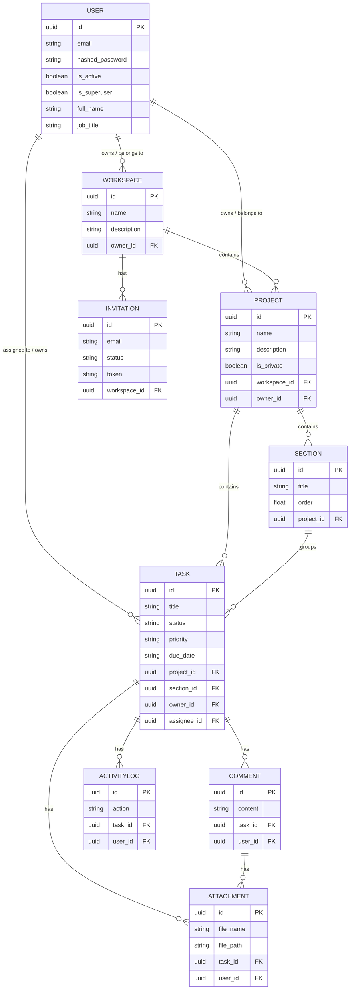

# DOit - Project Blueprint & Architecture

This document provides a high-level overview of the DOit application's blueprint and architectural design.

## Core Architecture Overview

DOit follows a modern, containerized client-server architecture. The system is split into distinct, specialized services that communicate internally over a private Docker network and are exposed securely to the outside world via a reverse proxy.

### 1. Reverse Proxy (Traefik)
- **Role**: Acts as the single entry point for all incoming web traffic.
- **Function**: Automatically handles SSL/TLS certificate generation (via Let's Encrypt) and routes incoming requests based on the domain/subdomain to either the frontend application or the backend API.

### 2. Frontend (React)
- **Role**: The user-facing dashboard.
- **Function**: A Single Page Application (SPA) built with React, TypeScript, and Vite. It consumes the backend REST API to render workspaces, projects, and tasks dynamically. 

### 3. Backend API (FastAPI)
- **Role**: The core business logic engine.
- **Function**: Built with Python and FastAPI, it handles user authentication, data validation (via Pydantic), and database interactions (via SQLModel). It serves a RESTful JSON API that the frontend consumes.

### 4. Database Layer (PostgreSQL & Redis)
- **PostgreSQL**: The primary relational database used for storing users, workspaces, projects, and tasks. It ensures data persistence and integrity.
- **Redis**: An in-memory data store used for caching, session management, and potentially handling background task queues to keep the main API fast and responsive.

---

## Entity Relationship Diagram (ERD)

Below is the database schema and relationships mapping for the PostgreSQL database.



---

## Architecture Diagram

Below is the high-level infrastructure diagram of the DOit application deployed via Docker Compose:

```mermaid
graph TD
    Client((Client Browser))
    
    subgraph Docker Host Environment (VPS)
        direction TB
        
        Traefik[Traefik Reverse Proxy\n& SSL Manager]
        
        subgraph Services
            Frontend[Frontend Container\nReact / Vite]
            Backend[Backend Container\nFastAPI / Python]
            DB[(Database Container\nPostgreSQL 17)]
            Redis[(Cache Container\nRedis)]
        end
    end
    
    %% Traffic flow
    Client -->|HTTPS requests| Traefik
    
    %% Internal Routing
    Traefik -->|Routes to dashboard.*| Frontend
    Traefik -->|Routes to api.*| Backend
    
    %% Data Flow
    Backend <-->|SQL Queries / Data Persistence| DB
    Backend <-->|Cache & Fast Memory Access| Redis
```

## Data Flow Lifecycle

1. **User Request**: A user visits `https://dashboard.yourdomain.com`.
2. **Proxy Intercept**: Traefik intercepts the request on port 443, verifies the SSL certificate, and forwards the traffic to the **Frontend Container**.
3. **App Initialization**: The React application loads in the user's browser.
4. **API Interaction**: As the user navigates, the React app makes background HTTP/REST calls to `https://api.yourdomain.com`.
5. **API Routing**: Traefik intercepts this API request and safely routes it to the internal **Backend Container**.
6. **Data Processing**: The FastAPI backend validates the request, checks authentication, and queries **PostgreSQL** or checks **Redis** for cached data.
7. **Response**: The Backend returns JSON data to the Frontend, updating the user interface seamlessly.
