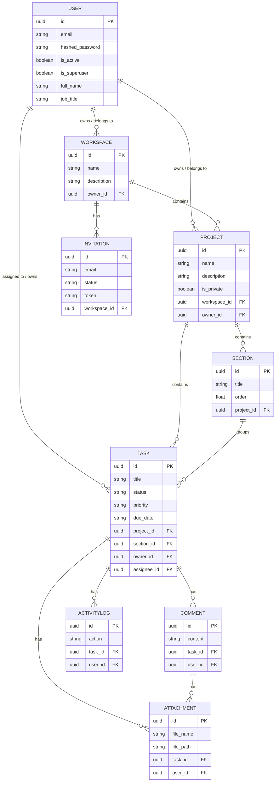

# DOit — System Architecture & Project Showcase

## 1. Executive Summary & Project Context

DOit is a modern, fully dockerized Task Management Platform designed for teams and individuals to organize projects, tasks, and workspaces. It is built with a focus on performance, scalability, and security.

The system utilizes a multi-tenant hierarchy comprising **Workspaces**, **Projects**, **Workflow Sections**, **Tasks**, **Comments**, and **Attachments**.

### Domain Entities
- **User:** Can own or belong to workspaces and projects, and be assigned tasks. Features JWT-based login.
- **Workspace:** The highest level of organization, containing projects and managing member invitations.
- **Project:** Resides within a workspace, organizing tasks into logical groupings. Can be private or public.
- **Section:** Groups tasks within a project (e.g., "To Do", "In Progress", "Done").
- **Task:** The fundamental unit of work, containing status, priority, due dates, assignments, comments, attachments, and an activity log.

---

## 2. Entity Relationship Diagram (ERD)

Below is the database schema and relationships mapping for the PostgreSQL database.



---

## 3. Component Architecture & High-Level Design

DOit follows a modern, containerized client-server architecture. The system is split into distinct, specialized services that communicate internally over a private Docker network and are exposed securely to the outside world via a reverse proxy.

### Architecture Diagram

```mermaid
graph TD
    Client((Client Browser))
    
    subgraph Docker Host Environment (VPS)
        direction TB
        
        Traefik[Traefik Reverse Proxy\n& SSL Manager]
        
        subgraph Services
            Frontend[Frontend Container\nReact / Vite]
            Backend[Backend Container\nFastAPI / Python]
            DB[(Database Container\nPostgreSQL 17)]
            Redis[(Cache Container\nRedis)]
        end

        subgraph Observability
            Promtail[Promtail Scraper]
            Loki[Loki Log Store]
            Grafana[Grafana Dashboards]
        end
    end
    
    %% Traffic flow
    Client -->|HTTPS requests| Traefik
    
    %% Internal Routing
    Traefik -->|Routes to dashboard.*| Frontend
    Traefik -->|Routes to api.*| Backend
    Traefik -->|Routes to grafana.*| Grafana
    
    %% Data Flow
    Backend <-->|SQL Queries / Data Persistence| DB
    Backend <-->|Cache & Fast Memory Access| Redis

    %% Observability Data Flow
    Backend -.->|JSON Logs| Promtail
    Services -.->|Docker Sock Logs| Promtail
    Promtail -->|Log Push| Loki
    Grafana -->|Query Datasource| Loki
```

### 3.1 Frontend Architecture (React)
The frontend is a Single Page Application (SPA) built with **React**, **TypeScript**, and **Vite**. It handles routing with React Router and provides a responsive dashboard with Dark Mode support.

```text
frontend/src/
├── api.ts                # Central Axios instance with JWT Authorization interceptor
├── components/           # Reusable UI primitives & shared presentation components
│   ├── Common/           # Global layout & shared presentation (NotFound, Navigation, Header)
│   └── ui/               # Shadcn/UI primitive components (Button, Card, Dialog, Badge, Toast, etc.)
├── hooks/                # Custom TanStack Query & Application hooks
│   ├── useAuth.ts        # Authentication state, login, signup, logout
│   ├── useProjects.ts    # Project detail & list query hooks
│   ├── useTasks.ts       # Task queries & mutations (dual key invalidation)
│   ├── useWorkspaces.ts  # Workspace management & member role mutation hooks
│   └── useTheme.ts       # Dark/Light theme mode hook
├── lib/                  # Utilities (clsx, tailwind-merge)
└── pages/                # Top-level view components
    ├── Dashboard.tsx            # Personal dashboard overview
    ├── ProjectDetailPage.tsx    # Grouped Workflow section list view & task drawer
    ├── TasksPage.tsx            # Global "My Tasks" view with search & filters
    ├── WorkspaceDetailPage.tsx  # Workspace details & owner role management
    ├── WorkspacesPage.tsx       # Workspace list & member invite modal
    ├── SettingsPage.tsx         # Profile edit modal, password update, appearance
    ├── AdminPage.tsx            # Platform user management (Superuser only)
    └── AcceptInvite.tsx         # Invitation processing view
```

**Key Technical Patterns:**
- **Server State Management:** Handled entirely by **TanStack Query (React Query v5)**. Automatic caching, background refetching, dual query key invalidation on write mutations (`["project", id]` and `["tasks"]`), and optimistic updates.
- **Styling:** **Tailwind CSS v4** + **Shadcn UI** primitives for accessible, responsive, dark-mode-ready interface components.

### 3.2 Backend Architecture (FastAPI)
The core business logic engine is a RESTful API built with **Python** and **FastAPI**, leveraging asynchronous request processing, strict Pydantic v2 data validation, and SQLModel/SQLAlchemy ORM data models.

```text
backend/app/
├── api/
│   ├── deps.py           # Dependency Injection (SessionDep, CurrentUser, SuperUser)
│   ├── main.py           # API Router aggregation
│   └── routes/           # Domain REST endpoints (auth, users, workspaces, projects, tasks, comments)
├── core/
│   ├── config.py         # Pydantic Settings management (ENV parameters)
│   ├── db.py             # SQLAlchemy Engine & Session Generator
│   ├── redis.py          # Redis client singleton and helper methods
│   └── security.py       # Password hashing (bcrypt) & JWT token creation/verification
├── models.py             # Database Table definitions (SQLModel / SQLAlchemy Declarative)
├── schemas.py            # Pydantic request & response DTO schemas
└── services/             # Business logic layer (auth_policy, task_service, workspace_service)
```

**Key Technical Patterns:**
- **Dependency Injection:** FastAPI `Depends` for Database sessions (`SessionDep`), User authentication (`CurrentUser`), and Authorization checks.
- **Data Validation:** Strict separation between DB Entities (`models.py`) and API Data Transfer Objects (`schemas.py`).
- **Database ORM:** PostgreSQL 17 accessed via SQLAlchemy 2.0 / SQLModel with UUID primary keys and explicit foreign key cascades.
- **Role Authorization:** Granular policy checks enforcing Workspace Owner privileges for role updates/removals and Project Membership for task access.

---

## 4. Data Flow & Authorization Lifecycle

### 4.1 Request Data Flow
1. **User Request**: A user visits `https://dashboard.yourdomain.com`.
2. **Proxy Intercept**: Traefik intercepts the request on port 443, verifies the SSL certificate, and forwards the traffic to the **Frontend Container**.
3. **App Initialization**: The React application loads in the user's browser.
4. **API Interaction**: As the user navigates, the React app makes background HTTP/REST calls to `https://api.yourdomain.com`.
5. **API Routing**: Traefik intercepts this API request and safely routes it to the internal **Backend Container**.
6. **Data Processing**: The FastAPI backend validates the request, checks authentication, and queries **PostgreSQL** or checks **Redis** for cached data.
7. **Response**: The Backend returns JSON data to the Frontend, updating the user interface seamlessly.

### 4.2 Authentication Strategy
1. **User Login:** Client sends POST request to `/api/v1/login/access-token` with credentials.
2. **JWT Issuance:** Backend returns an encrypted JWT `access_token` containing user identifier (`sub`) and expiration time.
3. **Client Storage:** Token stored in `localStorage`.
4. **API Requests:** Central Axios interceptor attaches `Authorization: Bearer <token>` to all HTTP requests.
5. **Unauthorized Handlers:** On 401/403 responses, client interceptor redirects to `/login`.

### 4.3 Workspace & Project Authorization Hierarchy
- **Workspace Level**: Users can only retrieve workspaces they belong to or own. Superusers have elevated administrative access.
- **Workspace Roles**: Workspace Owners can promote members to Admin, demote Admins to Member, or remove members (`PUT/DELETE /api/v1/workspaces/{id}/members/{user_id}`). Admins and Members are restricted from modifying workspace roles.
- **Project Access**: Non-project members requesting project details or tasks receive HTTP 403 Forbidden.

---

## 5. Deployment & Containerization

The system is fully containerized using multi-stage Docker builds:
- **Frontend Container:** Multi-stage build (Node.js build stage -> Nginx Alpine serving static production assets).
- **Backend Container:** FastAPI Python container executing UV dependency management & Uvicorn ASGI server.
- **Reverse Proxy:** Traefik listening on ports 80/443 with automatic TLS certificate generation.
- **CI/CD Pipeline:** GitHub Actions workflow (`deploy-remote.yml`) performing automated linting, testing, Docker image creation, and SSH deployment.
